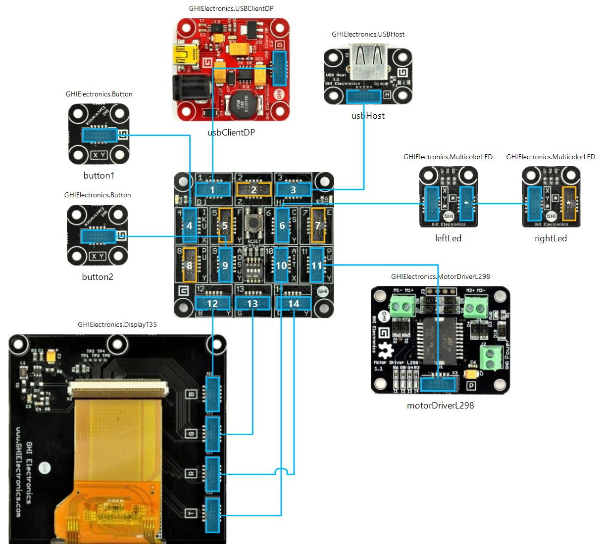

# Robot
Mouse controlled robot built using .NET Gadgeteer framework.

## Software
* [Visual Studio Community 2015](https://www.visualstudio.com/)
* [.NET Micro Framework SDK Version 4.3 (QFE2)](http://netmf.codeplex.com/)
* [.NET Gadgeteer Core and Builder Templates](http://gadgeteer.codeplex.com/)
* [GHI Electronics NETMF SDK 2015 R1](https://www.ghielectronics.com/support/netmf/sdk/38/ghi-electronics-netmf-sdk-2015-r1)

## Hardware
[GHI FEZ Spider Starter Kit](https://www.ghielectronics.com/catalog/product/297)
* [FEZ Spider Mainboard](https://www.ghielectronics.com/catalog/product/269)
* [USB Client EDP Module](https://www.ghielectronics.com/catalog/product/525)
* [Display TE35 Module](https://www.ghielectronics.com/catalog/product/387)
* 2x [Multicolor LED Module](https://www.ghielectronics.com/catalog/product/272)
* 2x [Button Module](https://www.ghielectronics.com/catalog/product/274)
* [USB Host Module](https://www.ghielectronics.com/catalog/product/270)
* [Motor Driver L298 Module](https://www.ghielectronics.com/catalog/product/315)

## Diagram

## Video

